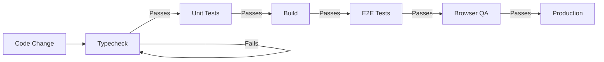

# Mermaid Diagram Generator Skill

## Purpose

Generate GitHub-friendly Mermaid diagrams with clean syntax and simple structure.

## When to Use

When a visual plan or source card requires a diagram:
- Agent loop diagrams
- Process flow diagrams
- Fleet loop coordination
- Validation gate sequences
- Research-to-application flows

## Behavior

### Diagram Creation

1. **Choose diagram type**
   - Flowchart (flowchart LR/TD/TB)
   - Graph (for networks)
   - State diagram (for lifecycles)
   - Sequence diagram (rare, complex)

2. **Keep it simple**
   - 5-10 nodes maximum
   - Clear labels (specific, not generic)
   - Obvious direction (LR/TD)
   - Standard syntax only

3. **Write clean Mermaid**
   ```mermaid
   flowchart LR
       A[Start] --> B[Process]
       B --> C{Decision}
       C -->|Yes| D[End]
       C -->|No| B
   ```

4. **Use consistent styling**
   - Subgraphs for grouping (when helpful)
   - Same shapes for same concepts
   - Decision nodes as diamonds
   - Terminal nodes as rounded shapes

5. **Test in GitHub**
   - Paste into README
   - Verify rendering
   - Check for syntax errors
   - Adjust if needed

### Syntax Rules

**DO**:
- Use `flowchart LR` for left-to-right
- Use `flowchart TD` for top-down
- Use standard node types: `[text]`, `{text}`, `((text))`
- Use simple subgraphs
- Add comments for clarity

**DON'T**:
- Use experimental Mermaid features
- Use custom styling extensively
- Create overly complex graphs
- Mix diagram types in one diagram

## Inputs

- Diagram spec from Visual Systems Designer
- Process description
- Flow or structure to visualize

## Outputs

- `.mmd` file in `docs/diagrams/`
- Rendered test result
- Syntax validation

## Example

**Input**: "Create a validation gates diagram showing typecheck → tests → build → E2E → browser → deployment"

**Output**:


File: `docs/diagrams/proben-validation-gates.mmd`

## Related Skills

- **Source to Visual**: Provides visualization ideas
- **Visual Plan Builder**: Defines what needs visualization
- **Portfolio Process Page**: Embeds diagrams in pages
