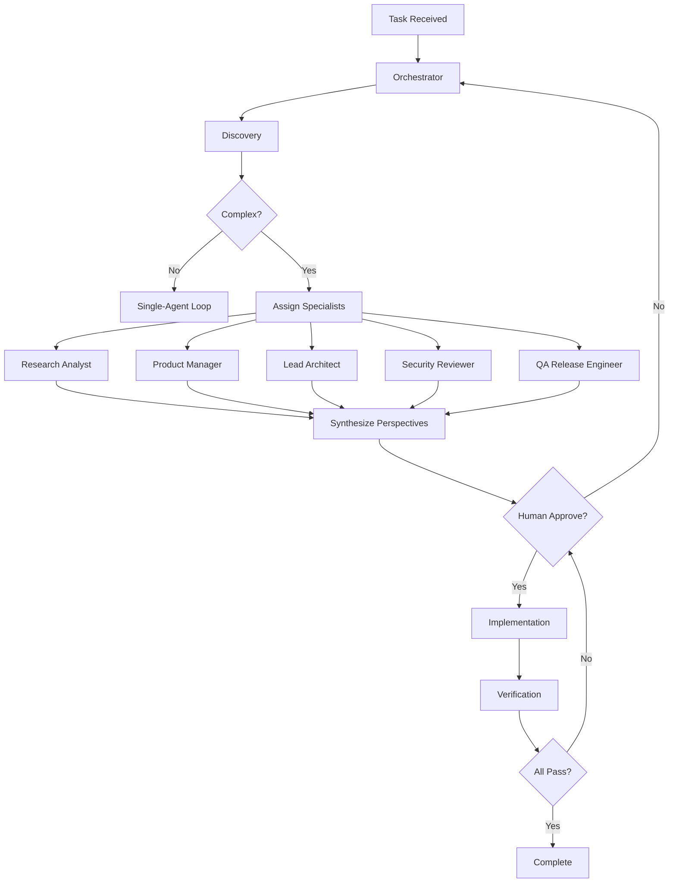
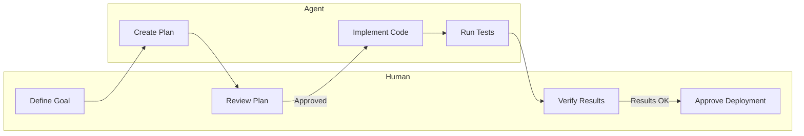

# Agent Loop Visuals - Proben.io

This document provides guidance on creating and using agent loop diagrams for Proben.io.

## Last Updated: 2026-06-09

---

## Purpose

Agent loop diagrams make the structure of AI-assisted development visible. This document explains how to create effective diagrams for single-agent loops, fleet loops, and related patterns.

---

## Diagram Types

### 1. Single-Agent Loop Diagram

Shows how one agent moves through a task:

```mermaid
flowchart LR
    A[Task Received] --> B[Discovery]
    B --> C[Planning]
    C --> D[Execution Proposal]
    D --> E{Human Approve?}
    E -->|No| C
    E -->|Yes| F[Execution]
    F --> G[Verification]
    G --> H{Acceptance Met?}
    H -->|No| C
    H -->|Yes| I[Complete]
```



**When to use**:
- Explaining single-agent loop approach
- Simple tasks (UI fixes, doc updates, tests)
- Portfolio pages showing systematic approach

**Key elements**:
- Discovery phase (understanding)
- Planning phase (breaking into steps)
- Execution proposal (before code)
- Human approval gate
- Execution (actual work)
- Verification (checking results)
- Iteration back to planning if needed

---

### 2. Fleet Loop Diagram

Shows how orchestrator and specialists work together:



**When to use**:
- Complex tasks requiring multiple perspectives
- Architecture decisions
- Security-sensitive changes
- Portfolio pages showing sophistication

**Key elements**:
- Orchestrator owns overall goal
- Specialists contribute from their perspectives
- Synthesis combines all perspectives
- Human approval before implementation
- Verification after implementation

---

### 3. Human-Agent Handoff Diagram

Shows where humans work and where agents work:



**When to use**:
- Explaining human-in-the-loop approach
- Security reviews
- Portfolio pages showing oversight

**Key elements**:
- Human defines goals
- Human reviews plans
- Human verifies results
- Human approves deployment
- Agents create, implement, test

---

## Diagram Standards

### Simplicity Rules

1. **5-10 nodes maximum**: More nodes = harder to understand
2. **Clear labels**: Specific, not generic ("Type check" not "Verify")
3. **Consistent shapes**: Same shapes for same concepts
4. **Clear flow**: Left-to-right or top-to-bottom
5. **Show decisions**: Diamond nodes for yes/no
6. **Show iteration**: Loops back to previous steps

### Mermaid Syntax

Use these Mermaid types:
- `flowchart LR` for left-to-right flows
- `flowchart TD` for top-down flows
- `flowchart TB` for bottom-up flows

Avoid:
- Experimental Mermaid features
- Custom styling (GitHub renders basic)
- Over-complex subgraphs

---

## Creating Agent Loop Diagrams

### Step 1: Identify the Loop Type

Ask:
- Is this a single agent or fleet loop?
- Is human oversight needed?
- How many specialists are involved?

### Step 2: Map the Phases

List the phases:
- Discovery
- Planning
- Execution
- Verification
- Iteration

### Step 3: Identify Decision Points

Where are decisions made?
- Human approval?
- Acceptance criteria check?
- Iteration needed?

### Step 4: Draw the Flow

Create the Mermaid diagram:
1. Start with main flow
2. Add decision points
3. Add iteration loops
4. Add human gates
5. Test in GitHub

---

## Diagram Maintenance

### When to Update

Update agent loop diagrams when:
- Loop structure changes
- New agent roles added
- Verification criteria change
- Process improvements identified

### Update Process

1. Update the `.mmd` file
2. Test rendering in GitHub
3. Update references in docs
4. Update portfolio pages if embedded
5. Commit with clear message

---

## Using Diagrams in Portfolio

### Embedding in Pages

Diagrams should be embedded in portfolio pages with:
- Explanatory context
- What the diagram shows
- Why it matters
- How it applies to Proben.io

### Example Page Structure

```markdown
## The Single-Agent Loop

[Diagram]

This is how Proben.io uses single-agent loops for small tasks like UI fixes and doc updates. The agent runs through discovery, planning, execution, and verification, with human approval before implementation.
```

---

## Related Documentation

- **Diagram Library**: `docs/visual-process/DIAGRAM_LIBRARY.md` - All diagram types
- **Visual Process System**: `docs/visual-process/VISUAL_PROCESS_SYSTEM.md` - Overall philosophy
- **AI Development Loop**: `docs/AI_DEVELOPMENT_LOOP.md` - Loop details

---

## See Also

- **Loop Policy**: `docs/LOOP_POLICY.md` - When to use which loop
- **Mermaid Diagrams**: `docs/diagrams/*.mmd` - Actual diagram files
