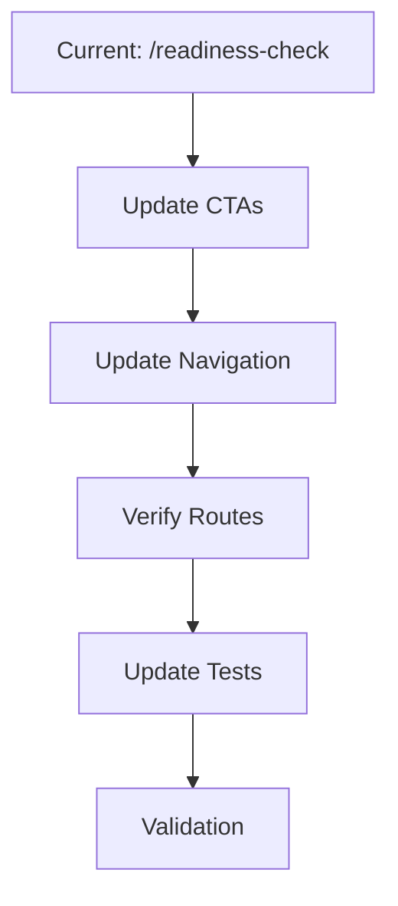
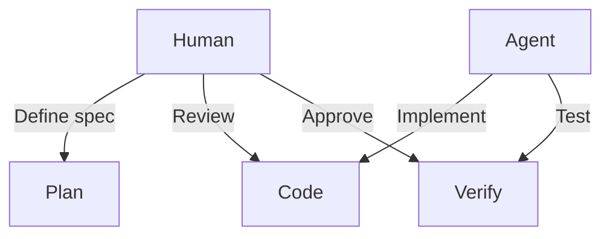
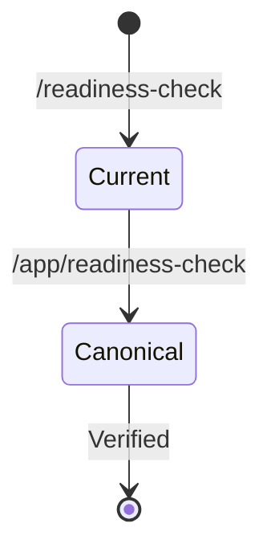
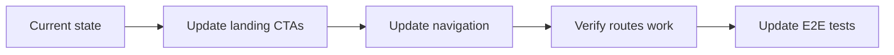

# Visual Plan Template - Proben.io

This document defines the standard template for creating visual plans before implementation.

## Last Updated: 2026-06-09

---

## Purpose

Visual plans make it easy to review and approve work before agents implement code. This template defines the standard structure for visual plans at Proben.io.

---

## Why Visual Plans

### vs. Text-Based Specs

**Text specs are fragile**:
- Long markdown walls hide requirements
- Trade-offs buried in prose
- Dependencies scattered across sections
- Hard to review quickly

**Visual plans are clear**:
- Flowcharts show sequence explicitly
- Tables show trade-offs clearly
- Diagrams make relationships visible
- Easy to scan and review

### vs. Jumping to Code

**Jumping to code causes rework**:
- Agent implements wrong interpretation
- Human reviews after code written
- Requirements missed or misunderstood
- Time and tokens wasted

**Visual plans prevent rework**:
- Human reviews plan before code
- Misunderstandings caught early
- Agent implements correct interpretation
- Less waste, better quality

---

## Visual Plan Structure

Every visual plan should include:

### 1. Goal Statement

**One sentence**: What we're trying to accomplish.

**Example**: "Update all readiness check CTAs to use the canonical route /app/readiness-check."

### 2. Task Map

**Visual representation**: How the task breaks down.

**Format**: Flowchart or diagram showing:
- Starting state
- Required changes
- Dependencies
- Ending state

### 3. Flow Diagram

**Step-by-step**: Sequence of changes.

**Format**: Numbered list or flowchart:
1. Update landing page hero CTA
2. Update landing page bottom CTA
3. Update navigation component
4. Verify compatibility route works
5. Update E2E tests

### 4. Requirements

**What must be done**: Bulleted, specific.

**Format**:
- Requirement 1 (specific, testable)
- Requirement 2 (specific, testable)
- Requirement 3 (specific, testable)

### 5. Constraints

**What NOT to do**: Boundaries and limitations.

**Format**:
- DO NOT add new features
- DO NOT change unrelated files
- DO NOT modify other routes

### 6. Trade-offs

**Why this approach**: Options considered.

**Format**: Table:
| Option | Pros | Cons | Decision |
|--------|------|------|----------|
| Option A | | | ✓ Selected |
| Option B | | | ✗ Rejected |

### 7. Risks

**What could go wrong**: With mitigations.

**Format**:
- Risk: Description → Mitigation: How to handle

### 8. Validation Gates

**How we know it worked**: Testable criteria.

**Format**:
- [ ] Type check passes
- [ ] Unit tests pass
- [ ] Build succeeds
- [ ] E2E tests pass
- [ ] Browser verification complete

### 9. Implementation Slices

**Vertical slices**: How to break into chunks.

**Format**:
- Slice 1: Core functionality (must have)
- Slice 2: Edge cases (should have)
- Slice 3: Polish (nice to have)

---

## Visual Plan Formats

### Format 1: Flowchart

**Best for**: Sequential processes, clear dependencies

**Example**:

### Format 2: Table

**Best for**: Trade-offs, comparisons, options

**Example**:
| Aspect | Option A | Option B | Decision |
|--------|----------|----------|----------|
| Route | /readiness-check | /app/readiness-check | Use /app/ as canonical |
| Compatibility | Redirect only | Both routes render | Both routes render |

### Format 3: Swimlane

**Best for**: Human vs agent responsibilities, parallel work

**Example**:

### Format 4: State Diagram

**Best for**: State transitions, before/after

**Example**:

---

## Creating a Visual Plan

### Step 1: Define the Goal

Start with a clear, specific goal:
- "Update X to do Y"
- "Add feature Z with behavior Q"
- "Fix issue A by doing B"

### Step 2: Map the Task

Create a visual representation:
- What's the starting state?
- What needs to change?
- What's the ending state?
- What are the dependencies?

### Step 3: Define Requirements

List specific, testable requirements:
- "CTA must point to /app/readiness-check"
- "Navigation must use canonical route"
- "Compatibility route must also render"

### Step 4: Identify Constraints

List what NOT to do:
- "DO NOT add new features"
- "DO NOT change other routes"
- "DO NOT modify unrelated files"

### Step 5: Document Trade-offs

Show why this approach:
- What options were considered?
- Why was this option chosen?
- What was rejected and why?

### Step 6: Identify Risks

What could go wrong?
- How likely is it?
- How do we mitigate it?

### Step 7: Define Validation

How do we know it worked?
- What tests must pass?
- What verification is needed?
- What are the acceptance criteria?

---

## Visual Plan Quality Checklist

Before approving a visual plan:

- [ ] Goal is specific and clear
- [ ] Task map shows the full scope
- [ ] Requirements are testable
- [ ] Constraints are explicit
- [ ] Trade-offs are documented
- [ ] Risks have mitigations
- [ ] Validation gates are defined
- [ ] Diagram renders correctly
- [ ] Human can review in 5 minutes or less
- [ ] Agent can implement from this plan alone

---

## Visual Plan to Implementation

### Human Reviews Plan

Checklist:
- [ ] Is the scope right?
- [ ] Are requirements clear?
- [ ] Are constraints explicit?
- [ ] Is validation defined?
- [ ] Is this worth doing now?

### Agent Implements

Agent uses visual plan as context:
- Task map provides structure
- Requirements provide specifics
- Constraints provide boundaries
- Validation provides success criteria

### Verification After Implementation

Check if plan matched implementation:
- [ ] All requirements implemented?
- [ ] All constraints respected?
- [ ] All validation gates passed?
- [ ] Any deviations from plan?

---

## Template Example

### Visual Plan: Readiness Check Route Update

**Goal**: Update all readiness check CTAs and navigation to use canonical route /app/readiness-check

**Task Map**:

**Requirements**:
- Landing page hero CTA → /app/readiness-check
- Landing page bottom CTA → /app/readiness-check
- Navigation "Readiness Check" → /app/readiness-check
- Compatibility route /readiness-check must also work

**Constraints**:
- DO NOT add new features
- DO NOT change readiness check functionality
- DO NOT modify /sample-report route

**Trade-offs**:
| Option | Pros | Cons | Decision |
|--------|------|------|----------|
| Redirect only | Simple | Loses /readiness-check URLs | ✗ |
| Both routes render | URLs work, clear canonical | More files | ✓ |

**Validation**:
- [ ] Type check passes
- [ ] Unit tests pass (21/21)
- [ ] Build succeeds
- [ ] E2E tests pass (8/8)
- [ ] Manual browser verification complete

---

## Related Documentation

- **Diagram Library**: `docs/visual-process/DIAGRAM_LIBRARY.md` - Diagram types and when to use them
- **Agent Loop Visuals**: `docs/visual-process/AGENT_LOOP_VISUALS.md` - Loop-specific visuals

---

## See Also

- **Context Strategy**: `docs/context/CONTEXT_STRATEGY.md` - Task-specific context
- **AI Development Loop**: `docs/AI_DEVELOPMENT_LOOP.md` - Overall loop structure
